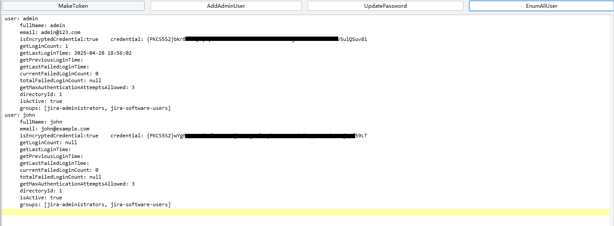

# PostJiraPlugin
java8 编译jar，有些报错去不掉（搞不懂），不影响使用  by N0ld

**https://github.com/dddd-N0ld/PostJiraPlugin/releases/download/jar/PostJiraPlugin.jar**

哥斯拉PostJiraPlugin后渗透插件 addAdminUser updatePassword EnumAllUser makeToken ........

## 功能简介
当你在Jira拥有一个哥斯拉webshell之后，你就可以使用哥斯拉的Jira后渗透插件

1. MakeToken
   1. 不需要密码登录任意用户 使用场景:sso/目标有严格的认证机制
2. AddAdminUser
   1. 添加一个可登录管理员用户
3. UpdatePassword
   1. 修改任意用户的密码
4. EnumAllUser
   1. 枚举所有的用户 包括用户名,用户密码,用户手机号,用户IM账号,用户所在地址,用户所在部门,用户主页,用户当前登录失败次数,用户总登录失败次数,用户上次登录失败时间,用户上次登录成功时间,用户所在域,用户是否存活,用户所在组

## 使用方法
与https://github.com/dddd-N0ld/PostConfluence 一致，使用哥斯拉4加载插件即可

## 部分功能演示

### MakeToken

### EnumAllUser

### AddAdminUser

### UpdatePassword

